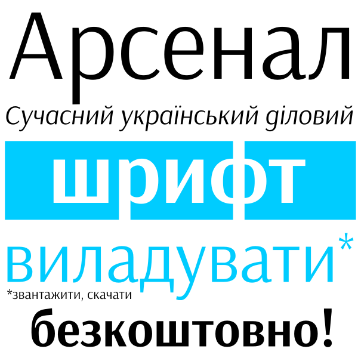
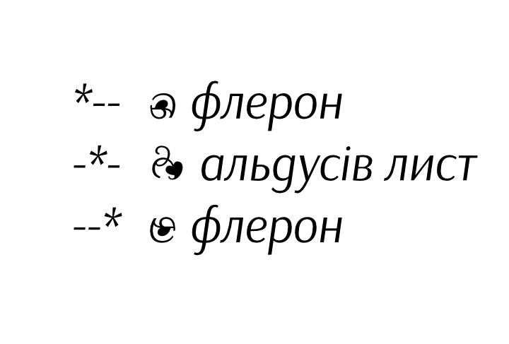

# Arsenal Font

Web Specimen: [https://alexeiva.github.io/Arsenal](https://alexeiva.github.io/Arsenal/)

#### Open-source font by [Andrij Shevchenko](1)

In 2011 Andrij's typeface became a winner of [Ukrainian Type Design Competition 'Mystetsky Arsenal][2]' in which three main criteria were sought for: being zeitgeist, practical, and Ukrainian. Andrij's winning entry was crowned Arsenal and made publicly available.
 
Arsenal is a semi-grotesque with traditional forms. It is primarily designed for body text and intended for various professional communication. Its special qualities of letter shapes and subtle contrast modulation articulate grace and expressivity. Arsenal's somewhat lyrical sentiment abides to the Ukrainian nature of the font.

Design Features:

 * Narrow proportions for economical type-setting.
 * Moderate aperture
 * Observable contrast
 
Notable Traits:

 * Neutrality
 * Clarity
 * Swiftness
 
### Project Timeline

- 2011 (v.1.000) Original Latin (except pan-African, and Asian) and Cyrillic (except Asian languages) were designed by [Andrij Shevchenko][1]. 

- 2016 (v.2.000) Further Cyrillic expansion to GF Cyrillic Pro was completed by [Cyreal][3].

- 2016 (v.2.000) Vietnamese language support was added by Nhung Nguyen <vns.wonderland@gmail.com>.

### Copyright

Copyright 2012 Stairsfor and the Arsenal Project Authors 

### License

This Font Software is licensed under the SIL Open Font License, Version 1.1. This license is available with a FAQ at: [http://scripts.sil.org/OFL][4]

### Links

 * [Arsenal on Behance][5]
 * [Arsenal on Ukrainian Type][2]
 * [Stairsfor][6]
 * [Arsenal MDL Specimen][7]

[1]: http://www.myfonts.com/newsletters/cc/201202.html
[2]: http://www.ukrainian-type.com/about/
[3]: http://cyreal.org
[4]: http://scripts.sil.org/OFL
[5]: https://www.behance.net/gallery/5540223/Arsenal-free-typeface
[6]: http://stairsfor.com/
[7]: https://alexeiva.github.io/Arsenal/

##### [UA]

Переможець конкурсу на сучасний український шрифт в чотирьох традиційних відмінах (прямій, письмівці, грубішій та грубішій письмівці) для кирилиці (крім азійської) та латинки (крім азійсько-африканської) випущений під відкритою ліцензією.

«АРСЕНАЛ» – набірний шрифт. Напівзакритий ґротеск традиційних форм. Ефективний для використання в діловій документації.

Риси:

* Вузькі пропорції,  що забезпечують економність на шпальті
* Достатня відкритість форм
* Помітний контраст

Важливі якості:

* Нейтральність
* Прозорість
* Швидкість

Контраст та побудова літер надають йому більшої виразності та м’якості, а дещо ліричний характер – українського колориту.

### Ліцензія

Шрифт має вільну та відкриту ліцензію [SIL Open Font License][4].

